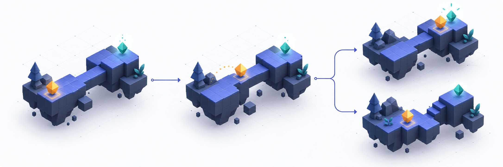
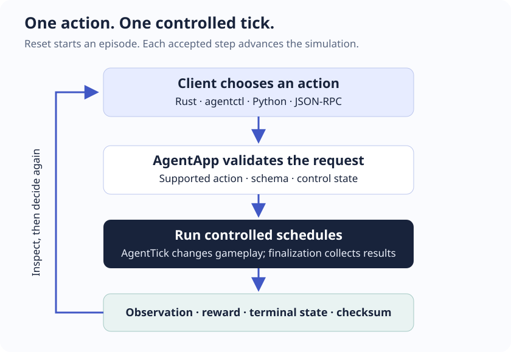

# Bevy Agent

**Step, inspect, snapshot, and replay your Bevy game.**



Bevy Agent gives a game or simulation an explicit control loop: reset an episode, submit an action, advance one tick, and read the result. Use it for agent experiments, automated gameplay tests, reproducible bug reports, and comparing decisions from the same saved state.

[**Documentation**](https://briansunter.github.io/bevy-agent/) · [Getting started](https://briansunter.github.io/bevy-agent/getting-started.html) · [Examples](https://briansunter.github.io/bevy-agent/examples.html) · [Changelog](CHANGELOG.md)

| Release | Bevy | Rust | License |
| --- | --- | --- | --- |
| **0.0.4 · experimental** | **0.18.1** | **1.91+** | MIT or Apache-2.0 |

APIs may change before 1.0. Pin companion crates to the same exact version. The runtime is headless by default; rendering is optional.

## Start here

| I want to… | Start with |
| --- | --- |
| Try a working simulation | [Run the counter below](#try-it) |
| Build a new environment | [Complete standalone Rust tutorial](https://briansunter.github.io/bevy-agent/getting-started.html) |
| Integrate an existing Bevy game | [Game integration guide](https://briansunter.github.io/bevy-agent/controllable-game.html) |
| Control a game from another process | [CLI and HTTP](https://briansunter.github.io/bevy-agent/guides/remote-control.html) or [Python](https://briansunter.github.io/bevy-agent/guides/python.html) |
| Catch simulation regressions | [Testing and reproducibility](https://briansunter.github.io/bevy-agent/guides/testing.html) |

## Try it

No API key, model service, or window is needed for the counter:

```sh
git clone https://github.com/briansunter/bevy-agent.git
cd bevy-agent
cargo run -p bevy_agent_runner --example counter --locked
```

Expected output:

```text
Snapshot restore and replay matched; counter is back at tick 1.
```

The [complete counter source](crates/bevy_agent_runner/examples/counter.rs) defines the world, registers its state, and checks that restoring and repeating an action produces the same checksum. Run its regression tests with:

```sh
cargo test -p bevy_agent_runner --example counter --locked
```

For a game with movement, collisions, coins, rewards, and terminal conditions:

```sh
cargo run -p sample_platformer --example agent_play --locked
```

The platformer and Python client live in this repository. They are not separate registry packages.

## How it fits together



Your game owns its rules and authoritative state. Bevy Agent provides controlled schedules, input validation, history, and the client interface. It does not choose actions for you or make arbitrary frame-driven gameplay deterministic.

For a new Rust environment, begin with:

```toml
[dependencies]
bevy = { version = "=0.18.1", default-features = false, features = ["std", "bevy_log", "bevy_state", "serialize"] }
bevy_agent_core = "=0.0.4"
bevy_agent_runner = "=0.0.4"
bevy_agent_snapshot = "=0.0.4"
```

The [getting-started guide](https://briansunter.github.io/bevy-agent/getting-started.html) supplies the complete manifest and app, including serialization dependencies. Install `AgentControlPlugins::default()`, run gameplay in `AgentTick`, register snapshot state, and provide observation and checksum extractors. There is no umbrella `bevy_agent` crate.

## Control a game from the terminal

From the checkout, start the sample server in one terminal:

```sh
cargo run -p sample_platformer --example remote_http --locked -- 127.0.0.1:4000 --artifact-dir ./artifacts
```

In a second terminal:

```sh
cargo install bevy_agent_cli --version 0.0.4 --locked
agentctl info
agentctl action-space
agentctl reset --seed 42
agentctl step '{"type":"Move","x":1.0,"y":0.0}'
agentctl observe
```

The Cargo package **`bevy_agent_cli`** installs **`agentctl`**. The CLI connects to `http://127.0.0.1:4000/rpc`; it does not launch a game. Discover the action catalog before controlling another environment. See the [CLI guide](https://briansunter.github.io/bevy-agent/guides/remote-control.html) for response fields, authentication, files, and error handling.

## Packages

| Crate | Responsibility |
| --- | --- |
| [bevy_agent_core](https://crates.io/crates/bevy_agent_core/0.0.4) | Schedules, actions, clock, RNG, observations, rewards, checksums |
| [bevy_agent_snapshot](https://crates.io/crates/bevy_agent_snapshot/0.0.4) | Registered gameplay state, validated snapshots and restore |
| [bevy_agent_replay](https://crates.io/crates/bevy_agent_replay/0.0.4) | Input logs, checkpoints, branching timeline topology |
| [bevy_agent_runner](https://crates.io/crates/bevy_agent_runner/0.0.4) | `AgentApp`, plugin composition, stepping, history, capture |
| [bevy_agent_remote](https://crates.io/crates/bevy_agent_remote/0.0.4) | JSON-RPC over HTTP, WebSocket, and stdio |
| [bevy_agent_cli](https://crates.io/crates/bevy_agent_cli/0.0.4) | The `agentctl` command-line client |

[Choose dependencies and features →](https://briansunter.github.io/bevy-agent/reference/crates.html)

## Guarantees and boundaries

- **Determinism is a game contract.** Use `SimClock`, seeded randomness, stable identities, complete state coverage, and explicitly ordered systems. Cross-platform floating-point equivalence is not guaranteed.
- **Snapshots contain registered gameplay state.** Keep rendering, UI, audio, and sockets separate. Snapshot/replay format **3** is independent of the Cargo version; older formats are rejected.
- **History is bounded.** Snapshot and replay owners each default to configurable 64 MiB retention budgets. Checksums detect inconsistencies; they do not authenticate artifacts.
- **Remote mutations need recovery discipline.** HTTP/WebSocket retry keys deduplicate one intended request while its result is retained. A faulted environment requires a successful reset. See [retries and recovery](https://briansunter.github.io/bevy-agent/guides/recovery.html).
- **File access is explicit.** The library disables it by default. Sample-server files resolve under `./artifacts`. Bind locally or configure authentication for a network listener.

## Contributing

[Development commands](https://briansunter.github.io/bevy-agent/reference/contributing.html) · [Architecture](https://briansunter.github.io/bevy-agent/architecture.html) · [Publishing](https://briansunter.github.io/bevy-agent/publishing.html) · [Report an issue](https://github.com/briansunter/bevy-agent/issues)

```sh
npm ci
npm run docs:dev
```

To build and check the guide, run `npm run docs:build && npm run docs:check`. CI and documentation deployment use manual GitHub Actions workflows. On the pinned personal Mac mini, follow the [build-storage instructions](https://briansunter.github.io/bevy-agent/reference/contributing.html#personal-mac-mini) before native builds.

## License

Dual-licensed under [MIT](LICENSE-MIT) or [Apache-2.0](LICENSE-APACHE), at your option. Both license texts are included in every release package.
