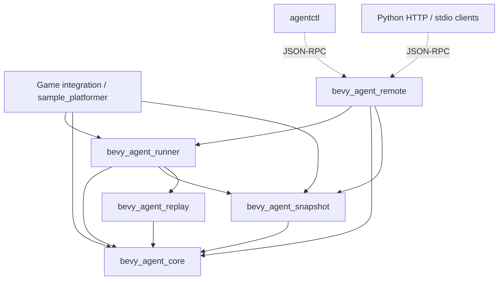
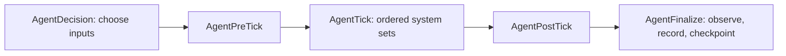

# Architecture, invariants, and improvement plan

This document explains the workspace's ownership boundaries, the execution and
history model, the problems found during the architecture review, and the plan
used to address them. The design keeps an explicitly stepped Bevy `World` as the
authority. Clients, presentation, and network transports adapt that authority;
they do not introduce a second simulation model.

## Dependency graph

An arrow means “depends on.” The CLI and Python client communicate through the
wire protocol and do not link the simulation crates.



`snapshot` and `replay` are siblings. Snapshot storage should not acquire a
dependency on replay just to learn which snapshots remain referenced. The
runner already owns both and supplies the reference set when creating,
pruning, or deleting checkpoints. Similarly, protocol schemas belong to the
remote adapter, while gameplay action validation belongs to core.

| Owner | Responsibility | Boundary to preserve |
| --- | --- | --- |
| `bevy_agent_core` | Schedules, clock, RNG, stable identities, action arbitration, observations, terminal state, deterministic hashing | No snapshot storage, history navigation, filesystem, or socket ownership |
| `bevy_agent_snapshot` | Registration, serialization, capture, preflight validation, restore/remapping, rollback, retention | No replay policy or client authorization |
| `bevy_agent_replay` | Action history, executed ticks, branch topology, checkpoint visibility, recording lifecycle | No app ownership or gameplay execution |
| `bevy_agent_runner` | App lifecycle, controller operations, reconstruction, coordinated checkpoints, portable bundle validation/activation, capture hooks | Delegate serialization and lineage rules to their owners |
| `bevy_agent_remote` | JSON-RPC envelopes, request validation, capabilities, artifact confinement, discovery, HTTP/WebSocket and main-thread scheduling | Validate before invoking a mutating runner operation |
| `sample_platformer` | Serializable gameplay state, deterministic systems, observation/checksum extraction, presentation | Provide an example game rather than framework policy |
| `agentctl` / Python | Command construction, transport, envelope verification, typed convenience methods | Interpret server results without inventing simulation state |

This is a small layered library, so adding a service container, generic command
bus, or new crate for every internal concern would increase coordination cost.
Private responsibility modules and explicit root reexports provide useful
boundaries while keeping the package graph small. Obsolete aliases, duplicated
execution context, and legacy replay representations are removed so there is
one current contract to reason about.

### Implementation map

Each crate root declares its modules and exports its public interface. The
implementation is organized by the state or boundary it owns:

| Crate | Modules |
| --- | --- |
| Core | `types/` for action, clock, control, error, identity, observation, and schedule contracts; `runtime` for plugin/tick execution; `catalog`, `integration`, `queue`, and `schema` for checked game contracts; `checksum` for stable encodings and `memory` for retained JSON accounting |
| Snapshot | `model`, `registry`, `builtins`, `serialization`, `capture`, `restore`, `checksum`, `store`, `plugin` |
| Replay | `model`, `log`, `timeline`, `recording`, `owner` |
| Runner | `plugins`, `control`, `outcome`, `history`, `checkpoints`, `bundle`, `capture`, `transaction` |
| Remote | `security`, `protocol`, `rpc`, `schema`, `http`, `websocket`, `server`, `main_thread`, `transport`, `operations` |
| Sample | `model`, `simulation`, `observation`, `capture` |
| CLI | `commands`, `protocol`, `transport` |

Unit tests exercise owner invariants. Sample integration tests exercise
cross-crate transactions, and `scripts/smoke.py` exercises the process/wire
boundary using the actual binaries. Python command construction lives in one
shared facade; its transports own their distinct connection lifecycles.

## Simulation authority and execution

The core plugin has one configuration (`tick_hz`, default 60), and
`AgentControlPlugins::default()` installs the control/snapshot/replay stack.
There are no separate deterministic, remote, or visual-debug presets with
identical behavior. Visual builders choose Bevy presentation plugins; remote
builders choose a transport. Both use the same simulation configuration.

### Lifecycle

`AgentApp` owns a Bevy `App`. Its lifecycle consists of plugin initialization,
startup, episode reset, explicit controlled ticks, and optional ordinary frame
updates. A remote main-thread integration temporarily lends the application's
world to this same controller, then returns the world to Bevy. It must never run
a second authoritative simulation on a network thread.

`AgentApp::new`, `from_app`, and `from_running_app` are fallible. Constructor
validation checks resources, all controlled schedules, metadata, explicit
catalogs, extractors, clock, and pending inputs. `validate_world` checks a world
before a main-thread adapter transfers ownership. Missing integration returns
an error before stepping can panic on a missing resource.

Reset establishes a new episode: it resets clock, RNG, input, reward, terminal
state, and game-specific resources/entities; extracts the initial observation;
and, when enabled, creates the initial snapshot and starts fresh history.
Each game-owned resource needs an explicit reset policy even if it is not
visible in the first observation: reset episode-local state and retain intended
configuration. Snapshot and hash both kinds of authoritative state.

The standard controlled tick order is:



Inside `AgentTick`, ordered sets advance the clock, drain/arbitrate actions,
apply inputs, run simulation, and check terminal conditions. After post-tick
hooks finish, `AgentFinalize` collects observations, records replay state,
manages snapshots, and completes the tick. This final boundary ensures a
post-tick mutation cannot leave a response or checkpoint describing earlier
state. Gameplay systems belong in these ordered sets. Rendering and ordinary frame `Update` must not
advance authoritative physics or independently consume gameplay RNG.

History reconstruction skips `AgentDecision` and consumes recorded frames. The
execution context prevents autonomous policies from choosing fresh inputs and
prevents reconstructed ticks from being appended to live history. Empty input
frames still execute and must be recorded as completed ticks.

### Controller invariants

1. Validate an action or entire batch before initialization, enqueueing,
   truncation of future history, or clock advancement.
2. Terminal state is authoritative even if a cached response predates it.
   Repeated terminal calls cannot move entities, drain inputs, or add history.
3. A request-specific observation mode must not silently become the default for
   subsequent requests. Observation extraction may refresh cached output, but
   it must not advance a tick.
4. A paused or stopped recorder does not acquire new completed ticks, action
   records, or checkpoint/checksum entries merely because stepping continues.
5. Clock increments, elapsed time, action ticks, and reconstruction bounds must
   be validated rather than overflow or allow unbounded execution.
6. A failed rollback installs `FaultState`; subsequent stepping/navigation must
   require recovery rather than operate on partially restored state.

`step_many` always stops on the first `done` or `truncated` response and returns
its completed prefix. There is no `stop_on_done` option. `fast_forward` uses the
same terminal behavior. Batch failures expose how many steps completed; they do
not silently discard the fact that earlier ticks committed.

`step_many` validates the complete catalog input upfront. This gives atomic
*input rejection*. It does not promise that arbitrary game systems are
transactional across an entire successful batch. A panic or domain failure
inside an integrating game's system needs its own recovery strategy.
Custom schemas are compiled once and validated at registration. Draft 2020-12
validation admits only registered custom payloads before queue insertion,
reset, or truncation. Local references are supported; remote/file references
are rejected without network or filesystem resolution. Invalid registration
leaves the previous catalog intact. Strict action decoding rejects unknown
fields, including otherwise permissive internally tagged unit variants, and
checks raw numeric bounds before narrowing to `f32`.

The observation catalog declares supported modes and a schema for the complete
serialized `Observation`, including the tagged `Domain` wrapper. Output is
validated against this same schema. Unsupported modes fail explicitly. A
failed observation collection clears the cached step response and records a
transient `AgentTickFailure`, so a prior tick cannot masquerade as a successful
new result. Once reset or stepping begins mutation, a later error becomes a
`MutationFailure`: operation, tick before/after, `tick_committed`, completed
batch steps, and `recovery_required`. Failed observation finalization never
appends a successful replay frame or takes a periodic snapshot. Failures after
a tick advances—including checkpoint or replay-budget exhaustion—clear the
cached response and fault the runner. Observation, capture, export, navigation,
and stepping require a successful reset before continuing. Reset clears the
fault and marks initialization complete only after observation and initial
checkpoint admission succeed. Preflight rejection leaves the world healthy;
a later batch preflight rejection can report a committed prefix with
`recovery_required: false`. JSON-RPC exposes this structure in `error.data`,
and schema discovery includes its contract.

`AgentActionQueue` owns a private tick-indexed map. Fallible scheduling rejects
past/current ticks and malformed actions; checked replacement validates an
entire restored queue before changing it. Bucket draining preserves insertion
order and multiplicity. Upcoming-tick validation examines only its bucket;
constructor and import admission validate complete future queues.

## State, snapshots, and checksums

### Authoritative state inventory

A field is authoritative when it can affect future ticks or an exposed
observation. For the sample this includes transforms, velocity, collider
dimensions, grounded state, collected coins, score, terminal state, gameplay
configuration, and the last nonzero movement direction used by a later dodge.
The movement direction illustrates why a snapshot inventory cannot be inferred
only from visible entities: a resource can affect a future action while the
current picture remains identical.

Use the same inventory when designing reset, snapshot registration, and domain
checksums. A resource that is reset but not captured breaks restore. A captured
resource that is absent from a domain checksum weakens determinism diagnostics.
An observed coordinate omitted from the checksum permits two distinct exposed
states to share a checksum.

### Registration and capture

The snapshot registry associates concrete component/resource types with
capture, decode/validation, restore, and removal functions. Snapshots are
gameplay serialization, not complete engine serialization: sockets, windows,
GPU objects, audio devices, and asset-server state remain outside the contract.

Capture uses a serializer adapter that rejects non-finite `f32`/`f64` values
before serde_json can convert them to `null`. It checks nested options,
sequences, maps, structs, and enum variants. The captured payload then passes
the full restore preflight, including decode/serialize round-trip equality for
every registered type. Captures used as transaction backups obey the same
contract. Unrestorable live state rejects navigation before any world or owner
mutation; a decodable but lossy custom deserializer cannot admit a backup.

Use `register_required_snapshot_resource` for resources that gameplay, tick,
and observation systems require. Requiredness participates in the registry
schema and capture/restore reject a missing required value. The ordinary
`register_snapshot_resource` supports genuinely optional state. Core runtime
and sample gameplay resources use required registration so an import cannot
make a later `world.resource` call panic by deleting essential state.

Every gameplay type implements `SnapshotType` with a qualified stable
`TYPE_ID` and positive `SCHEMA_VERSION`. Payloads persist both values. Rust
module/type renames do not change the wire identity; changing a type's version
invalidates an incompatible payload. The registry rejects duplicate IDs across
different types or component/resource domains. Registrations and macros return
`Result`; a multi-type macro stages the registry and commits only when every
registration succeeds. Registry callbacks and collections are private.

Entities are keyed by `StableEntityId`; runtime Bevy `Entity` values are
ephemeral and may change on restore. Capture sorts authoritative entity state
and registered stable type IDs to make hashing independent of ECS iteration order.
Duplicate stable IDs must be rejected at capture time because they cannot
identify two distinct entities during restore.

The registry schema hash includes stable IDs, per-type versions, requiredness,
and the resource/component domains.
A union of their IDs cannot distinguish “type X is a component” from “type X
is a resource.” Domain tags and counts remove this ambiguity.

### Preflight and restore transaction

Checksum encoding is version 2; artifact schema versions and per-type versions
are independent contracts. Before destructive restore, validate:

- the supported snapshot schema version, game metadata, and registry schema;
- manifest and clock ticks, valid finite clock values, and checksum;
- unique stable entity IDs, resource names, and per-entity component names;
- no resource simultaneously declared present and absent;
- agreement between redundant core payloads, including the explicit clock/input
  fields and their registered resource representations;
- agreement between entity identity in the entity header and serialized stable
  ID component;
- registration of every payload type and successful decode of each value.

The prepare phase produces a restore plan without modifying the world. Applying
the plan recreates gameplay state and produces a stable-ID-to-`Entity` map. A
game's remap hook repairs references that contain raw entities. Verification
checks the reconstructed payload; on failure, the backup is reapplied using
the same remapping contract. Outer transaction rollback uses a validated backup
restore path that does not recapture partially applied state. This matters when
the destination serializer itself fails. Recreating the backup without remapping would
leave references pointing to entities destroyed by rollback.

Snapshot APIs return useful errors when required resources are missing. A
`Result`-returning API should not panic merely because its plugin was not
installed. This does not make arbitrary user callbacks panic-safe.

### Two checksum purposes

`EnvironmentChecksum` describes the game's deterministic state for clients and
domain tests. The integrating game controls its field coverage; the sample
uses a versioned domain checksum covering its complete authoritative inventory.
`SnapshotChecksum` verifies the registered serialized state and the clock.
These are distinct contracts and should not be interchangeable.

Replay reconstruction compares queue-excluded snapshot checksums. Pending
future inputs can legitimately differ at a restored cursor, so they must not
make an otherwise identical reconstructed tick appear divergent. The full
snapshot still captures those inputs for direct restore.

Hashing uses deterministic, explicit encodings with length and presence tags;
it avoids process-random hashers and unordered map iteration. These hashes are
consistency checks, not cryptographic authenticity proofs.

## Replay and branching

### Recording model

`ReplayLog` owns executed actions, completed ticks, branch-tagged checkpoints,
branch-aware expected checksums, recording bounds, topology, and the exported
cursor. `Timeline` owns current branch selection and parent/fork relationships.
Recorded action source remains metadata so reconstruction can faithfully
reapply an executed frame independently of current input arbitration mode.

Branch maps use typed `BranchId` keys, so malformed UUID keys fail during
deserialization. Timeline branches store graph metadata; action history has
one owner in `ReplayLog.records` and is not duplicated in each branch.

Recording may start after tick zero. `initial_tick` is the actual recording
baseline and must survive topology synchronization and export. A fallback to
the initial snapshot must use that tick, not pretend its state occurred at
tick zero. Checkpoint manifest/clock ticks must agree with the tick at which
the log references them.

Histories use explicit branch identity. An unknown or malformed branch key
must not borrow another branch's history. A child sees parent records only up
to its fork; it cannot inherit later parent actions or checkpoints.

All parent traversals are bounded and detect cycles/missing parents. The same
rules apply to imported topology and already-installed in-memory topology.
Portable `ReplayLog` and `TimelineBranch` are editable DTOs. Live `Timeline`
and `ReplayRecorder` have private state, immutable views, and checked mutation
APIs. Admission validates complete topology/history; later navigation checks a
bounded lineage. Incremental topology synchronization may add branches but
cannot remove or rewrite an admitted branch's parent, fork tick, or fork snapshot. Live owners do not deserialize unchecked portable data.
`SnapshotStore` similarly exposes immutable payloads, checked imports and
pinning, and no mutable storage access. Imports preflight every payload and
identity conflict before installation. Pinning a missing payload fails.

### Reconstruction and pending inputs

To restore tick T, select a branch-visible checkpoint at or before T, restore
it, index recorded actions by tick, and execute only the interval needed to
reach T. Expected checksums inherit the same fork-bounded ancestry as actions;
the selected checkpoint is verified before mutation. Work limits apply to the actual checkpoint-to-target interval. The
current live tick alone cannot estimate reconstruction cost. A private
branch/tick index maps selected intervals to record positions and preserves
record ordering. Preflight borrows the log and stored checkpoint rather than
cloning complete history. Indexes are derived and rebuilt when admitting a
replacement log; they are excluded from portable serialization.

Pending inputs use explicit operation policy. Direct snapshot restore can
restore the captured queue. History reconstruction clears queued inputs that
would compete with recorded frames. Replay import replaces the queue using
imported futures, keeping only actions strictly after the activated cursor;
actions already consumed during reconstruction cannot reappear as pending.

After navigation, live stepping must apply the established branch/future
truncation policy before appending new history. Stepping before the active
branch's fork, or truncating an ancestor prefix inherited by a descendant,
requires an explicit `branch(current_tick)` first. Rejection preserves both the
world and history; the new branch selects the interval's owner and leaves old
descendants reproducible. Snapshot retention receives
the complete live reference set, including topology fork snapshots. Explicit
pins and live replay references are separate reasons a snapshot cannot be
evicted. `SnapshotStore::pinned()` contains only explicit manual pins;
`protected()` contains the active history's references. Initial/fork/baseline
roles receive temporary protection until the owner publishes references.
Replacing history releases abandoned automatic protection; repeated resets
retain only the current initial checkpoint plus explicitly retained payloads.

Snapshot payloads are immutable `Arc<Snapshot>` values. Store copies share
payloads and copy only indices. `SnapshotPolicy::max_snapshot_bytes` defaults to
64 MiB and charges encoded data, JSON arrays/strings/map allocations, and entry
overhead. Admission identifies evictable payloads before changing indices and
rejects atomically if manual pins or active history consume the budget. The
checkpoint-count policy still limits unreferenced checkpoints; it cannot evict
state needed to reconstruct active history.

`ReplayRecorder::set_max_history_bytes` configures a separate 64 MiB default
budget for actions, frame coverage, checksums, checkpoints, topology, and their
indices. Admission/replacement checks the whole incoming log; incremental
recording charges additions without rescanning old records. A live step whose
recording exceeds the budget reports its committed tick and requires reset.
Start a new recording to discard old history while retaining the current live
state, or reset to begin a new episode. These budgets bound charged retained
history rather than promising a process-wide RSS limit for arbitrary game
resources and temporary allocations.

### Navigation transaction boundary

Rewind, branch, and import share a transaction helper. It covers direct restore too, so failed observation extraction cannot leave the
new payload installed. It captures registered
simulation state, pending inputs, control identifiers, cached response,
transient failure, and controller lifecycle. Fork rollback retains shared store
payloads and a recorder savepoint containing only the topology, cursor, bounds,
checkpoint boundary, and charge counter. Reconstruction never appends actions,
so a fork does not copy the action log or its record index. Import and new
recording transactions move the previous store/recorder into the rollback
record and initialize replacement owners. Manual pins survive replacement;
other inactive payloads are dropped after a successful commit. Branch preflight validates
a supplied checkpoint before reconstructing; failure after reconstruction or
checkpoint creation restores the original cursor and all owners. If rollback
itself fails, owners and control bookkeeping still revert and `FaultState`
blocks further operation until reset.

Ordinary navigation reads and fork savepoints do not copy the full log.
Import rollback moves old owners back rather than rebuilding or copying them.
A failed import or fork preserves the original payload identities, history,
cursor, response, and control bookkeeping. Snapshot capture still serializes
the one live gameplay state required for rollback.

### Portable bundle ownership

`ReplayBundle` embeds its log and every referenced snapshot. UUID references
alone are insufficient for loading in a fresh process. The runner is the single
owner of full bundle preflight, including format, topology, branch/tick bounds,
snapshot references, payload validation, and temporal agreement. Remote
adapters call this validation and map failures into wire errors instead of
maintaining a second version of history rules.

Activation is transactional: save gameplay/control/history/storage state,
install the validated import, reconstruct its cursor, apply imported future
inputs, and verify the resulting tick. If activation fails, restore the
previous state and lifecycle flags. An import containing records without the
snapshots required to reconstruct them must fail before installation.

## Remote boundary and transports

### Request sequence

The bridge follows this order: parse JSON, validate the JSON-RPC envelope,
authenticate, decode/validate method parameters, authorize the complete
operation, and invoke the runner. JSON syntax errors use `-32700`; syntactically
valid invalid envelopes use `-32600`; invalid method inputs use `-32602`.
Correlation IDs must be null, an integer, or a string of at most 256
characters. Duplicate object keys and unknown envelope/parameter fields are
rejected. Complete messages are bounded before decoding.

One method declaration generates `RpcMethod`, typed `RpcCommand`, names,
parameter decoding, and per-method discovery schemas. Schemars derives schemas
from the actual wire DTOs; shared constants impose runtime bounds, and game
catalogs narrow action/mode variants. Response, envelope, error, nested
observation, and capture schemas use their serialized types. Conformance tests
validate real DTOs and responses against discovery and compare parameter
rejection with decoding. `prepare_request` exposes this pure bounded parser for
fuzzing without simulation or filesystem effects.

Validate return modes, positive tick counts, batch limits, import source
selection, and action catalog input before an implicit reset or other mutation.
Authorization covers the operation's observations and side effects, not only
its method name. For example, a restore returning debug state needs the relevant
observation capability; replay file export also needs filesystem permission.

Replay payloads have one JSON representation. Export either returns the inline
bundle or writes the JSON bundle file and returns its path/counts. Load accepts
exactly one of `bundle` and `path`. There is no duplicated base64 response or
bare-log import. Stopping recording returns status/counts; payload retrieval
remains the responsibility of export.

`RemoteSecurity` carries the token, capabilities, exact CORS response Origin, and
artifact root. A token that exists but is empty is not valid authentication for
a public bind. Filesystem operations remain confined to the resolved root;
path resolution checks existing ancestors for symlink escapes and exclusive
export avoids silently overwriting files.

### HTTP and WebSocket

The lightweight transport owns framing; simulation code receives complete
JSON messages. Its parser must enforce header/body limits, supported HTTP
versions, unambiguous Content-Length, unsupported transfer encoding rejection,
valid UTF-8, and an overall read deadline. Per-read timeouts alone allow a peer
to keep a request alive indefinitely by sending occasional bytes.

Bytes read after an HTTP header/body boundary belong to the next protocol
phase. In particular, WebSocket frames sent alongside the upgrade handshake
must survive upgrade. WebSocket input validates masking, opcodes, control-frame
length, message size, and UTF-8. Response CORS headers must match preflight;
successful preflight without the actual response header is unusable in a
browser.

Both adapters use fixed networking pools and bounded channels without an async
runtime. Defaults provide four normal connection workers, two admission
readers, one reserved health/status worker, eight entries in each connection
queue, and sixteen queued simulation commands. Admission parses a JSON-RPC
body once and transfers its prepared command to the selected worker; the raw
body is released. Long WebSocket sessions and simulation waits occupy normal
workers, leaving health and authenticated operation status available even when
all normal workers are busy. Header-reading capacity and all queues remain
bounded; saturation produces a bounded busy reply.

`RemoteServerStatus` exposes the first fatal cause and bounded counters for
accepted/rejected connections and failed I/O. Fatal accept errors stop
admission and propagate through headless `serve_until`; worker panics stop the
service too. The Bevy adapter installs the status resource and emits an error
`AppExit` once after a fatal failure. Shutdown closes tracked active sockets,
joins all pools, and releases the listener. An already executing game callback
finishes before orderly headless shutdown returns.

### Main-thread ownership

The Bevy plugin places prepared typed commands into a bounded queue and pumps
them on the main thread. Headless serving executes that same queue on one
simulation owner while connection workers handle I/O. Atomic lifecycle states distinguish queued, running, completed,
and cancelled work. A client timeout can cancel queued work; once mutation has
begun, the response must communicate that uncertainty rather than imply the
operation never happened.

Primary-window capture is asynchronous. Scheduling a screenshot is not
completion. Callback/deadline paths claim completion exactly once, retain
the original request ID, and release listener ownership when the app is dropped.
The acceptor maintenance loop expires capture deadlines instead of spawning a
watchdog thread for every capture.
Headless software capture shares the controller hook and does not need a GPU.

### Operation outcomes after timeout

The shared operation ledger records queued, running, completed, cancelled, and
error states. A queued timeout cancels before mutation; a running timeout
returns `execution_state: "unknown"` with an opaque operation ID, while execution
continues. For HTTP/WebSocket adapters, authenticated `agent.operations.status` queries the ledger directly,
bypassing the simulation queue, and returns the eventual original response.
Authentication happens before lookup. An expired or unknown ID cannot
establish cancellation.

An optional envelope `retry_key` contains 1–128 ASCII letters, digits, or
`-_.:`. Atomic ledger admission associates the key with a method and normalized
typed parameters, excluding the JSON-RPC ID and authentication token. Concurrent
or later retries share one queued/running/completed operation; completed replies
are correlated to each retry's current request ID. Reusing a key for different
parameters or a different method is rejected. A retry cannot cancel another
caller's queued operation just because its own deadline is shorter.

`agent.operations.status` accepts exactly one of `operation_id` or `retry_key`.
The latter recovers correlation even if the first connection disappeared before
receiving an operation ID. Keys belong to the authenticated server instance and
expire with their retained outcomes; they do not provide durable deduplication
across process restarts, TTL expiry, or capacity eviction. Choose a fresh key
for a new intent, including intentionally repeating an action after reset.
Direct bridge/stdio calls reject envelope retry keys because they have no
service ledger.

Defaults retain up to 256 entries and 64 MiB, with five-minute retention measured
from terminal completion. Capacity pressure may evict older terminal results;
active entries are never evicted and reserve enough bytes for the maximum
reply plus retained retry keys and normalized request identities. Saturation rejects admission. Network replies reserve 4 KiB of the 8 MiB
message budget so a retained response fits inside its status envelope. A waiting
caller retains its completion independently of ledger eviction. Operation IDs
are opaque lowercase hexadecimal/hyphen strings, with a 128-character input
bound. No request requires another thread solely for its outcome.

## Client boundaries

Python HTTP and stdio share one command facade so discovery, reset, stepping,
capture, and replay methods construct identical requests. Transports provide
`call`; the facade does not duplicate protocol parameter dictionaries.

Both clients validate JSON-RPC version, exact correlation ID, exclusive
result/error shape, and structured error values. Python booleans must not
accidentally compare equal to numeric request IDs. Decode, network, timeout,
EOF, and size errors use `AgentError` consistently. A valid remote error uses
the public `RemoteError` subclass with its code and structured data intact.
HTTP calls accept a keyword `retry_key`; reset, step, and batch helpers expose
it too. CLI uses `--retry-key`, and status can use `operation-status --key KEY`.
Both clients reject outbound messages larger than 8 MiB before connecting.

Stdio is a sequential request/response stream. A timed-out or malformed response
can destroy correlation with later calls, especially when a fallback reader
continues waiting in another thread. Mark the stream unusable after such
failures instead of allowing an old reader to steal a new response. Limits apply
to each line even when one read contains several lines.

The CLI separates command/options construction from HTTP transport and envelope
validation. Endpoint parsing rejects malformed authorities/control characters;
response parsing honors explicit framing and bounds; option parsing does not
consume a subsequent option as a missing value.

The remote server enforces absolute transport deadlines. CLI socket operations
share a call deadline, and stdio includes ownership acquisition, writing, and
response reading. Python HTTP shares a monotonic deadline across identifier
acquisition, request encoding, connection attempts, request writes, TLS, every
raw header/body read, redirects, error bodies, and response decoding. Socket
timeouts are updated with the remaining budget, so trickled headers or bodies
cannot renew a timeout. Python bounds DNS lookup with four daemon workers and
sixteen queued requests, waits only for the remaining call budget, and skips
expired queued lookups. A blocked operating-system lookup occupies a bounded
worker while the caller times out. The CLI checks elapsed DNS time after its
synchronous resolver returns.

## Review findings and implementation plan

The starting workspace had approximately 17,850 source/test lines. Runtime
crates were separate packages but each implementation was concentrated in one
large `lib.rs`: remote 3,780 lines, runner 3,508, snapshot 2,186, core 2,075,
replay 1,325, and sample 1,002. The CLI used one 761-line `main.rs`.
The current crate roots range from 14 to 133 lines, with a 32-line CLI entry
point. Responsibility modules retain the implementation and regression tests;
the root files provide a readable public interface.

The improvement sequence was:

1. Audit each state owner independently and inventory every behavior-changing
   field and cross-crate transaction boundary.
2. Extract responsibility modules and move tests beside their ownership
   boundary; remove compatibility aliases and obsolete format branches.
3. Remove duplicated replay bookkeeping/validation so the runner orchestrates
   rather than independently models history.
4. Repair demonstrated reset/restore/recording and snapshot integrity failures.
5. Validate remote inputs before mutation; harden framing, limits, deadlines,
   response correlation, and listener/capture lifecycle.
6. Share client command construction and enforce bounded strict response
   decoding in each transport.
7. Add regressions that observe future behavior and failed-operation state,
   then run headless, optional-feature, lint, documentation, and real transport
   checks.

| Finding | Implemented correction | Behavioral evidence |
| --- | --- | --- |
| Sample facing omitted from reset/snapshot/hash | Treat facing as authoritative serializable state | Reset and restore followed by standalone dodge reproduce direction |
| Sample checksum omits config/colliders/observed coordinates | Hash the full gameplay inventory with an explicit version | Hidden mutations change checksum |
| Post-tick hooks run after observation/checkpoint systems | Finalize responses/history after all post-tick hooks | Response, restored state, and reconstructed checksum include post-hook changes |
| Batch validation differs between APIs | Validate whole batch at controller entry | Invalid later action leaves tick/state unchanged |
| Terminal state depends on cached response | Gate on authoritative episode state | Externally terminal world does not advance |
| Stopped recorder gains completed ticks | Use the recording owner's guarded bookkeeping | Stepping after stop leaves log unchanged |
| Rewind divergence erases inherited history | Require an explicit fork before destructive ancestor divergence | Rejected stepping preserves descendants; explicit branches remain exportable |
| Snapshot storage uses a stale episode | Propagate recording identity through reset/import | Checkpoint and snapshot episode identities agree |
| Bundle validation duplicated | Runner preflight used by local and remote paths | Same malformed bundles fail before installation |
| Pending imported actions resurrect | Filter imported futures beyond cursor | Consumed inputs remain absent after load |
| Snapshot structurally ambiguous | Reject duplicate/conflicting payloads before mutation | Recomputed malicious checksum cannot bypass structural checks |
| Snapshot capture accepts duplicate identities | Reject duplicate stable IDs during capture | No unrestorable snapshot is created |
| Rollback loses entity remapping | Apply remap hook during rollback too | Entity references remain valid after failed restore |
| History traversal can loop forever | Central bounded traversal and strict branch identity | Cyclic/malformed topology returns promptly |
| Recording baseline rewritten | Keep actual initial tick through export/selection | Mid-episode recording reconstructs correct interval |
| Invalid request can trigger reset | Validate params before initialization | Rejected requests preserve uninitialized state |
| HTTP framing/deadline/CORS gaps | Strict bounded parser and security-aware writer | Socket tests cover ambiguity, limits, overread, and CORS |
| Responses and exports exceed readable limits | Bound serialization before writing | Oversized results return correlated errors and create no file |
| Empty token treated as authentication | Reject empty tokens at use/bind boundaries | Public bind cannot accept empty-token configuration |
| Stdio correlation fails after timeout | Poison failed streams; bound each line | Follow-up call cannot consume stale response |
| Duplicated Python wrappers | One facade over two transports | Same parameters and discovery methods across clients |

## Current contract and limits

Snapshot, replay-log, and replay-bundle formats are version 3. Stable type IDs
and explicit per-type versions replace Rust `type_name` wire identifiers.
Regenerate older artifacts; no compatibility shim or migration accepts version
2 payloads. Unsupported formats, identities, versions, schemas, modes, or
unknown fields fail through current contracts.

Integrations use `EnvironmentChecksum`, the core `ExecutionContext`,
`AgentControlPlugins::default()`, fallible `AgentApp` constructors and scheduling,
fallible snapshot registration, and `JsonRpcBridge::new(RemoteSecurity)`.
Replay stop returns counts; export owns payload retrieval. Artifact paths are
relative to the configured root.

The runtime does not promise cross-platform floating-point bit equality,
snapshot coverage for unregistered game state, or panic-safe arbitrary callbacks.
Connections are concurrent, but simulation remains serial. Running gameplay
callbacks cannot be forcibly interrupted; timeout outcome retrieval addresses
that uncertainty. Python supports concurrent calls through locked IDs and
serialized stdio request pairs. Primary-window rendering and screenshot readback
are checked through Bevy/wgpu under Xvfb with Mesa's CPU Vulkan adapter.
Physical-GPU drivers and a physical desktop window were not exercised locally.
Path ancestor checks do not provide descriptor-based confinement against an
adversary concurrently modifying the filesystem. Checksums detect consistency
errors and do not authenticate imports.

## Verification commands

Run from the repository root using Rust 1.91 or newer. The cloud workspace's
saved environment activation supplies its local native libraries; ordinary
Linux machines need the Bevy development packages used in CI.

```sh
cargo fmt --all -- --check
cargo test --workspace --all-targets --locked
cargo test --workspace --doc --locked
cargo clippy --workspace --all-targets --locked -- -D warnings
python3 -m unittest discover -s python/tests -v
cargo test --workspace --all-targets --all-features --locked
cargo clippy --workspace --all-targets --all-features --locked -- -D warnings
RUSTDOCFLAGS='-D warnings' cargo doc --workspace --no-deps --locked
RUSTDOCFLAGS='-D warnings' cargo doc --workspace --all-features --no-deps --locked
```

CI checks the minimum documented Python version (3.10) and Python 3.12, runs
headless and all-feature Rust validation, and checks documentation separately.
Integration verification should also start a fresh local server and exercise
HTTP/CLI/Python reset, stepping, capture, snapshot/restore, export/load, and
stdio calls against real messages.

The reusable smoke check owns temporary processes and artifacts, including a
WebSocket upgrade sent alongside its first frame:

```sh
cargo build --workspace --bins --examples --locked
python3 scripts/smoke.py
```

### Generated and stress validation

Owner tests cover deterministic generated operation sequences: snapshot capture,
restore, optional state, pins and retention; indexed replay versus reference
queries; runner step/schedule/rewind/fork/import; and sample physics futures
following successful and rejected operations. Failures compare exact portable
state, pending input, control/cache/lifecycle, and a subsequent-action oracle.
These complement focused corrupt-payload, rollback, scheduling, framing,
concurrency, retention, and shutdown regressions.

```sh
cargo test -p bevy_agent_runner navigation_preflight_benchmark -- --ignored --nocapture
cargo build -p sample_platformer --example primary_window_smoke --features visual --locked
WGPU_BACKEND=vulkan xvfb-run -a -s '-screen 0 1280x720x24' \
  target/debug/examples/primary_window_smoke /tmp/bevy-agent-primary-window
(cd fuzz && cargo +nightly fuzz run rpc_request -- -max_total_time=30 -max_len=1048576)
```

The ignored benchmark compares clone/scan preflight with borrowed indexed
preflight for the same checkpoint and full snapshot validation. On this Linux
workspace's debug build, fifty queries to tick 10 measured:

| History records | Clone and scan total | Borrowed indexed total |
| ---: | ---: | ---: |
| 1,000 | 45,162 µs | 8,171 µs |
| 10,000 | 360,225 µs | 8,441 µs |
| 100,000 | 3,519,062 µs | 8,672 µs |

Every case selects the same checkpoint, verifies its expected checksum, and copies ten reconstruction frames.
These timings describe this machine and build, rather than a performance SLA;
the benchmark asserts correctness and deliberately has no timing threshold.

The graphical smoke test runs the visual Bevy app, requests `primary_window`
capture through HTTP, and validates the screenshot callback's string-ID
correlation, controlled tick/frame, window dimensions, and rendered PNG pixels.
It exits Bevy and verifies listener release. The report includes the selected
adapter's name, backend, device type, and driver. The handoff run produced a
960×540 primary-window PNG with 15 distinct colors using `llvmpipe` / Vulkan /
`Cpu` (Mesa 25.0.7, LLVM 19.1.7) under Xvfb. This exercises the Bevy/wgpu render
pipeline, window surface, and screenshot readback on a software Vulkan adapter.
The separate transport smoke uses the sample's headless 640×360 software capture
renderer. Physical-GPU and physical-desktop compatibility remain unverified.
CI installs Xvfb/Mesa and executes the same window check. CI also runs libFuzzer
against the pure request parser, with checked-in
valid/malformed/deep/duplicate-key seeds.

### Completed local verification

The handoff verification reran all checks below against the final source after
DNS deadline hardening, using Linux, Rust 1.91, and Python 3.10.21 / 3.12.14.
The separate fuzz target used nightly Rust and libFuzzer. Test counts are totals
for each command, not additional independent suites; the all-feature run
includes the headless coverage.

| Check | Result |
| --- | --- |
| Workspace, headless, all targets | 352 tests passed; one benchmark intentionally ignored in the normal suite |
| Workspace, all features, all targets | 355 tests passed; one benchmark intentionally ignored in the normal suite |
| Python client | 63 tests passed on each of Python 3.10.21 and 3.12.14, including stalled DNS, resolver saturation, and trickled headers/bodies |
| Formatting, fuzz-target formatting, whitespace | Passed |
| Clippy, headless and all features, warnings denied | Passed |
| Workspace doctests | Passed |
| Rustdoc, headless and all features, warnings denied | Passed |
| Built binaries and examples | Passed |
| Real HTTP/CLI/WebSocket/stdio smoke | Passed, including an idle WebSocket alongside HTTP, idempotent Python/CLI retries, key-based status, explicit stdio retry rejection, snapshots, branches, version-3 replay round trips, and software PNG capture |
| Python TLS and proxy tunnel | Passed with a local HTTPS server and HTTPS through CONNECT |
| Bevy primary-window render/capture | Passed under Xvfb with `llvmpipe` / Vulkan / `Cpu`: 960×540, 15 distinct colors, tick/frame 1, original string correlation, listener closed; physical GPU/desktop unverified |
| Parser fuzzing | Handoff seeded 31-second run: 1,917,647 executions without a crash; earlier seeded run: 2,692,989 without a crash |
| Indexed navigation benchmark | Passed explicitly with equivalent checkpoint validation and ten selected frames at each history size |
| Sample agent play | Reached `goal_reached` at tick 129 |

CI repeats the headless/all-feature, Python, documentation, rendering, and fuzz
checks. The rendering job saves its PNG as an artifact. Fuzz regressions should
retain minimized named corpus seeds and focused tests. Local generated fuzz
corpus and build output remain outside the checked-in source.
